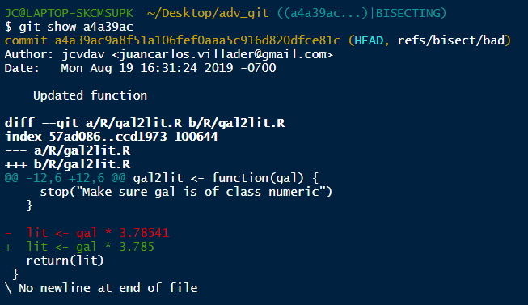

```{r setup, include=FALSE}
options(htmltools.dir.version = FALSE)

knitr::opts_chunk$set(echo = TRUE,
                      eval = FALSE)
```

# Outline

If you haven't, `fork` and `clone` the repo from: [https://github.com/emlab-ucsb/adv_git.git](https://github.com/emlab-ucsb/adv_git.git)

- Boring

  - Best practices
  
- Hands-on

  - Repo tour
  
  - Tests
  
      - functions / packages

      - `shiny` Apps
  
  - Finding the error

  - Fixing the error


---

class: center, middle, inverse

# Best practices

---

# Use the terminal


- It doesn't have to be scary

- You'll mostly use `pull`, `add`, `commit`, and `push`

- It forces you to think about what you have to `stage` and `commit`

- It's good to get comfortable, especially when you have to fix a repo


---

# Commit frequency

- Try to keep commits as small as possible

  - Don't just `stage` all and `commit` "updated repo" (we all do it)
  
  - If possible, break it down to files / topics / improvements
  
  - If possible, break it down to sections within a file

- You don't have to `push` all your changes

  - `commit` through the day, and `push` at the end


---

# Testing your code

Create tests for possible breaks:

- Test for data integrity

  - Number of records
  
  - Dimensions of a key `data.frame`
  
  - Dates in your `Raster*` objects
    
- Test for function behavior

  - Returns correct output
  
  - Handles `NA`s or `NULL`s correctly
  
  - Test for know breaks
  
--

**Test before pushing big changes**

---

# Using tags

If something (ever) works, mark it!

- After your `commit`, you can do:

`git tag -a version -m "message"`

For example:

```{bash}
**run tests in R**

git add scripts/foo.R #Stages the foo.R script

git commit -m "Added foo.R script" #This is our commit message

git tag -a v0.1 -m "foo.R working" #Add a tagg and a message
```

---

# Using tags

In the repo, try:

`git tag`

You should get:

```{bash}
v0.1
v0.2
v0.3
```

Not very informative, right?

---

# Using tags

Now try:

`git show v0.2`

```{bash}
tag v0.3
Tagger: jcvdav <juancarlos.villader@gmail.com>
Date:   Mon Aug 19 16:27:56 2019 -0700

Tests working with more precision

commit c581a28de5a13d576654cf6ae6491142f551d9bf (tag: v0.3)
Author: jcvdav <juancarlos.villader@gmail.com>
Date:   Mon Aug 19 16:27:20 2019 -0700

    Updated tests for more precision
```

---

# Using tags

Now try

```{bash}
git logline

# that's a shortcut for
git log --graph --pretty=format:'%Cred%h%Creset -%C(yellow)%d%Creset %s %Cgreen(%cr) %C(bold blue)<%an>%Creset' --abbrev-commit
```

or

```{bash}
git logone

# short for
git log --pretty=oneline
```


---

class: center, middle, inverse

# Repo tour

---

# Repo

```
-- adv.Rproj
-- basic_app
   |__app.R
   |__tests
-- DESCRIPTION
-- man
   |__gal2lit.Rd
-- NAMESPACE
-- R
   |__gal2lit.R
-- README.md
-- tests
   |__testthat
   |__testthat.R
```

---

class: center, middle, inverse

# Tests

---

# Shiny Apps

- The shiny app is under `basic_app/app.R`

- Run `shiny::runApp("basic_app")` or open the file and run the app

- Stop the instance

- Now let's run the tests:

  - Run `shinytest::testApp("basic_app")` or
  
  - Open the `app.R` file
  
  - Top-right corner, click on `Run App` >> `Run Tests`
  
  - Top-right corner, click on `Compare Results`
  
- Inspect the differences:

  - The app is not returning the correct conversion of gallons to liters
  
  - But is this an error in the app, or in the underlying code?

---

# Packages / functions

- In your root directory for the repo, look for a `tests` folder

- There is a `testthat.R` file, and folder with the same name

- Open `tests/testthat/test_gal2lit.R`

- To test the package (*i.e.* run all tests):

    - You can run `devtools::test()`
    
    - Take advantage of the Rstudio IDE:
    
        - Go to the `Build` pane
        
        - Click on `More`
        
        - Select `Test package` (or simply `Ctrl` + `Shift` + `T`)

---

```{bash}
==> devtools::test()
Loading adv
Testing adv
v |  OK F W S | Context
x |   0 2     | gal2lit converts correctly
---------------------------------------------
test_gal2lit.R:8: failure: gal2lit
gal2lit(1) not equal to 3.78541.
1/1 mismatches
[1] 3.79 - 3.79 == -0.00041

test_gal2lit.R:9: failure: gal2lit
gal2lit(1/3.78541) not equal to 1.
1/1 mismatches
[1] 1 - 1 == -0.000108
---------------------------------------------
v |   3       | gal2lit handles input types

== Results ==================================
OK:       3
Failed:   2
Warnings: 0
Skipped:  0
```

---

class: center, middle, inverse

# Well `r rep(emo::ji("poop"), 7)`

Turns out our basic function is not working...

Now what?

We (sort of?) know *where* the error is (this is an easy one)

But *when* / *how* / *why* / (**who???** `r emo::ji("angry")`)?

Enter: `git bisect`


---

# `git bisect`

## Why not go into GitHub?

- You want to be able to track incremental changes

- Let's you see how changes relate to tests / status of the repo

- If you use the `git bisect` approach, no need to leave RStudio!

---

# `git bisect`

## What does it do?

- You start by telling it that the present commit (state of the repo) is `bad`

- You then tell it when things worked (remember `tags`?)

- It choses a point (roughly) between them and checks out a version of how things looked like

- Then, you iterate:

    - Running your tests
    
    - Tagging each commit as `good` or `bad`
    
    - `git bisect` will advance in the logical direction

    -  Do until it finds the last good commit

---

# `git bisect`

## Workflow: finding

```{bash}
git logline #To see the history
git bisect start #Start bisecting
git bisect bad #Tagg current state as bad
git bisect good HASH / tag #Specify a state where things worked
# git bisect will take you to somewhere in the middle

**Run tests in R**

# If it works
git bisect good
#marks this point as working and moves forward in time
# If it fails
git bisect bad
#marks this pointas not working and moves backward in time

**Run tests in R**
... #Until test pass
```

---

# `git bisect`

## Workflow: fixing

We know *when* (*i.e.* HASH) things changed, let's dig deeper:

```{bash}
git bisect reset #Exit bisect mode (go back to the present)

git show HASH #Check the changes of the guilty commit
```


---

# `git bisect`

## Workflow: fixing



---

Let's fix the problem:

```{bash}
git branch #To check existing branches

git checkout -b fix_bug #To create a new branch and switch into it

git revert HASH #Will undo changes in that commit

# It is equivalent to just making the change yourself
# in `gal2lit.R` and `add` and `commit` the result

**Run tests in R**
```
---

# `git bisect`

## Workflow

```{bash}
git checkout master #Get back to master branch

git branch #Confirm that you are on master

git merge fix_bug master #Bring the changes in fix_bug into master

**Run tests in R** #optional, at this point

git tag -a vx.x -m "Fixed bug" #(Optionally, add a tag)

git push #Push changes
```


